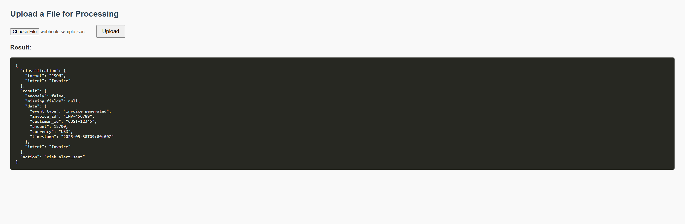
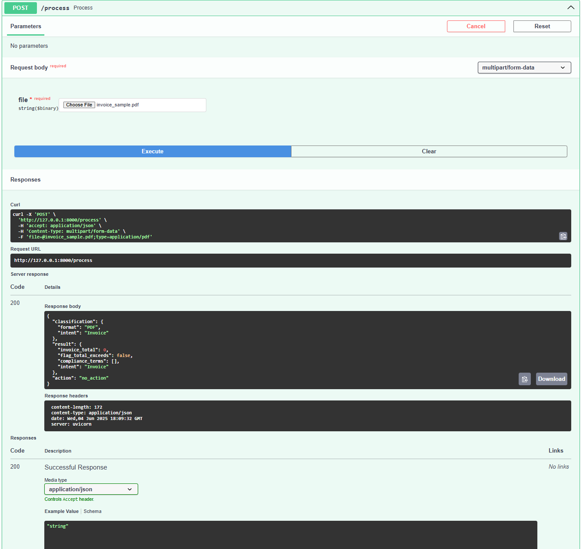
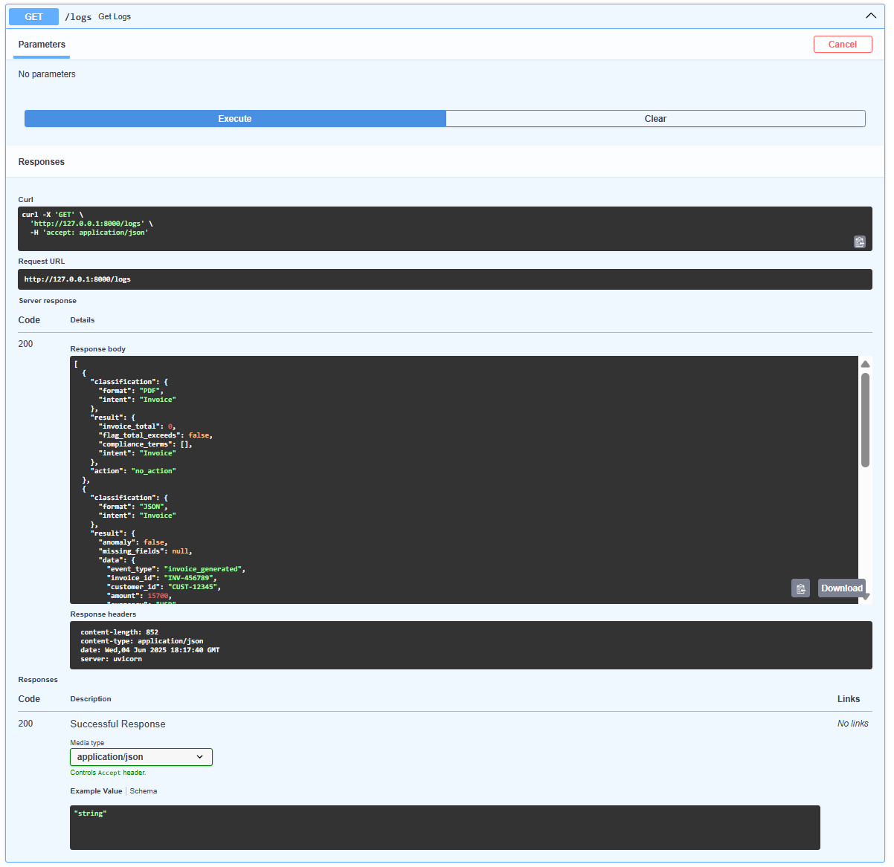
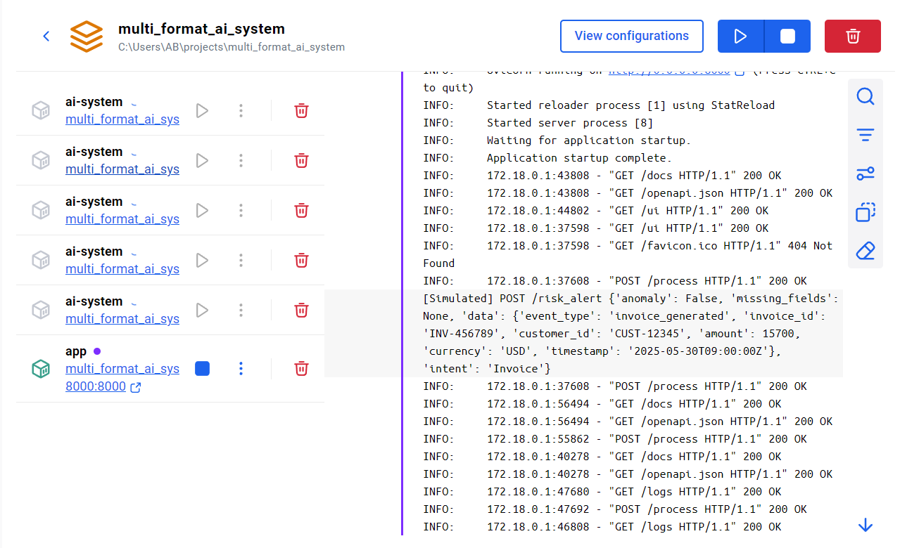

# 🧠 Multi-Format AI System with Contextual Decisioning & Chained Actions

This project is a modular, autonomous AI system capable of processing multiple input formats — **Email (.eml)**, **PDF (.pdf)**, and **JSON (.json)**. The system intelligently classifies the input, delegates it to the appropriate agent, determines intent, and routes actions based on contextual logic.

---

## 🚀 Features

- 🔍 **Classifier Agent** – Detects file format and infers user intent.
- 📩 **Email Agent** – Parses `.eml` files and extracts relevant fields.
- 📄 **PDF Agent** – Processes invoice-like PDFs.
- 📦 **JSON Agent** – Handles structured webhook data.
- 🔁 **Action Router** – Dynamically performs follow-up actions based on content.
- 🧠 **Memory Store** – Logs all activity and classification data.

---

## 🛡️ Project Structure

```
multi_format_ai_system/
├── app/
│   ├── agents/            # Format-specific processors
│   ├── memory/            # In-memory store
│   ├── router/            # Action router
│   ├── utils/             # Format-specific helpers
│   └── main.py            # FastAPI app entry point
├── data/                  # Sample files for testing
├── tests/                 # Test suite
├── Dockerfile
├── docker-compose.yml
├── requirements.txt
└── README.md
```

---

## ⚙️ Running the App

### Option 1: With Docker (Recommended)
```bash
docker-compose up --build
```

The API will be available at:  
👉 **http://localhost:8000**

### Option 2: Local Python (Dev mode)
```bash
pip install -r requirements.txt
uvicorn app.main:app --reload
```

---

## 📬 API Endpoints

### `POST /process`

Upload a `.pdf`, `.eml`, or `.json` file to be analyzed.

**Form field name:** `file`

**Example (cURL):**
```bash
curl -X POST "http://localhost:8000/process" -F "file=@data/sample_email.eml"
```

---

### `GET /logs`

Returns full processing logs stored in memory.

---

## ✅ Example Output

```json
{
  "classification": {
    "format": "Email",
    "intent": "RequestStatus"
  },
  "result": {
    "sender": "john@example.com",
    "subject": "Request Update",
    "intent": "RequestStatus"
  },
  "action": {
    "status": "Triggered status update process"
  }
}
```

---

## 🖼️ Screenshots

#### 1. UI Upload Page (`/ui`)
This is the simple upload interface available at `/ui`


> Shows the web interface where users can upload Email, PDF, or JSON files.

---

#### 2. Sample API Response
This shows a JSON response returned by the `/process` endpoint.


> Displays a full classification + intent + result JSON output from the API.

---

#### 3. Docker Logs
Output of running the system inside Docker, showing logs and processing.


> Shows the internal memory log trace that stores classification + actions for audit/debugging.

---

#### 4. Logs Endpoint Output
Result of hitting `/logs` to view audit trail in memory.


> Terminal screenshot showing the Docker container building and running the FastAPI app.

## 🎥 Demo Video

🎥 [Watch the Demo Video](https://www.youtube.com/watch?v=AopYRWwwjEY)

---

## 👨‍💼 Developed As Internship Project

**Title:** Multi-Format Autonomous AI System with Contextual Decisioning & Chained Actions  
**Role:** Intern Developer  
**Stack:** FastAPI, Python, Docker

---
